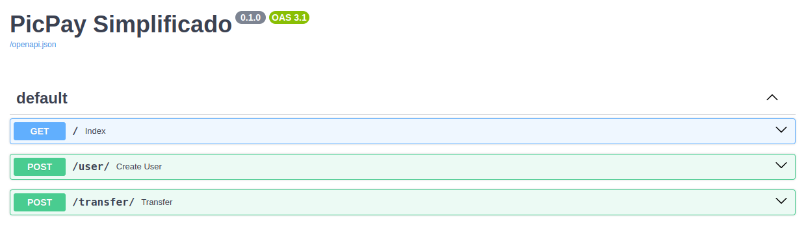

# Desafio Back-end PicPay (PicPay Simplificado)

Esse repositório implementa uma solução para o desafio [PicPay Simplificado](https://github.com/PicPay/picpay-desafio-backend?tab=readme-ov-file).




## Stack utilizada

**Back-end:** FastAPI

**Database:** SQLite

**Queue** Redis Queue


## Variáveis de Ambiente

Para rodar esse projeto, você vai precisar adicionar as seguintes variáveis de ambiente no seu .env

`DATABASE_URL`


## Rodando localmente

Clone o projeto

```bash
  git clone https://github.com/jv26tech/picpays
```

Entre no diretório do projeto

```bash
  cd picpays
```

Instale as dependencias com poetry

```bash
  poetry install 
```

Ative o ambient virtual

```bash
  poetry shell 
```

Efetue as migracoes do banco de dados

```bash
  alembic upgrade head 
```

Para inicializar o Redis Queue

```bash
  task queue 
```

Para inicializar o FastAPI

```bash
  task run 
```


## Documentação da API

#### Cria um user

```http
  POST /user
```

| Parâmetro   | Tipo       | Descrição                           |
| :---------- | :--------- | :---------------------------------- |
| `name` | `string` | **Obrigatório**. O nome do novo user. |
| `document` | `string` | **Obrigatório**. O CPF/CNPJ do novo user |
| `email` | `string` | **Obrigatório**. O email do novo user |
| `amount` | `float` | **Obrigatório**. O Saldo inicial do novo user |
| `role` | `string` | **Obrigatório**. O tipo de user (`customer`\|`seller`) |
| `password` | `string` | **Obrigatório**. A senha do novo user |

#### Efetua uma tranferencia

```http
  POST /transfer
```

| Parâmetro   | Tipo       | Descrição                                   |
| :---------- | :--------- | :------------------------------------------ |
| `payer`      | `int` | **Obrigatório**. O ID do item que você quer |
| `payee`      | `int` | **Obrigatório**. O ID do item que você quer |
| `amount`      | `float` | **Obrigatório**. O ID do item que você quer |

